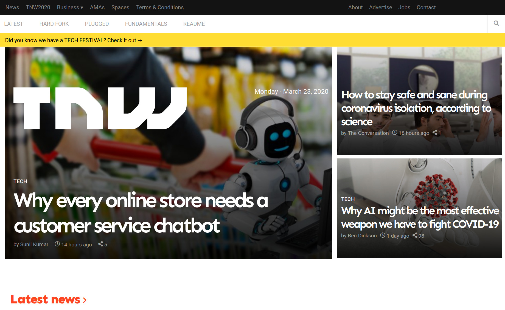
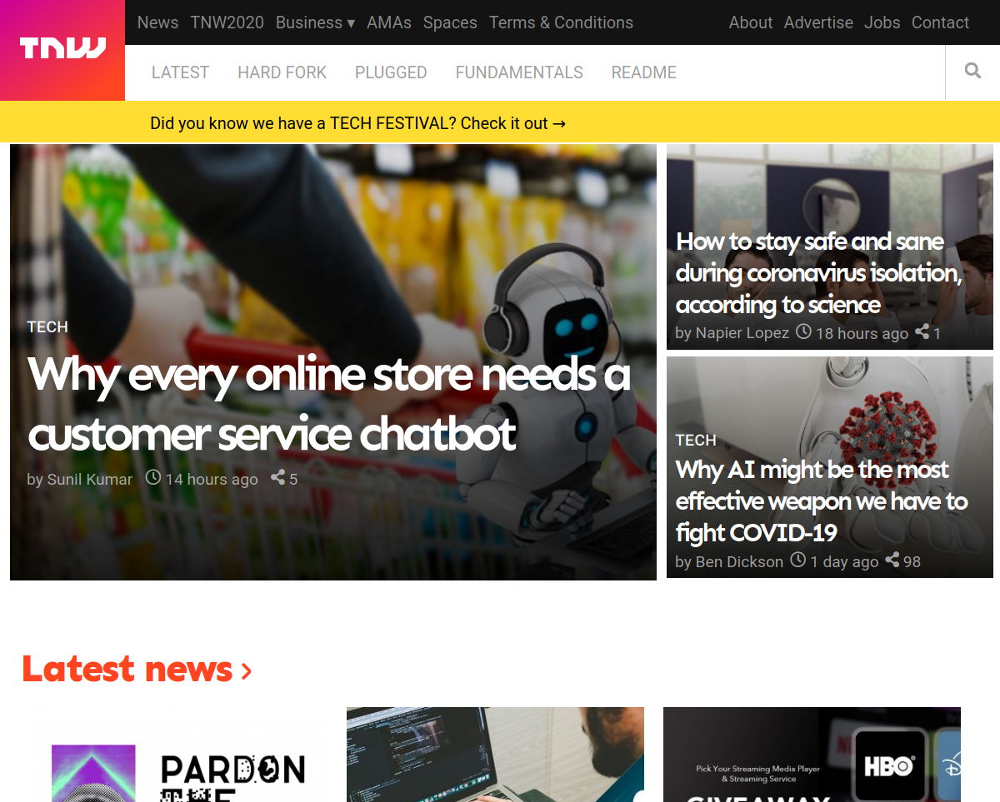
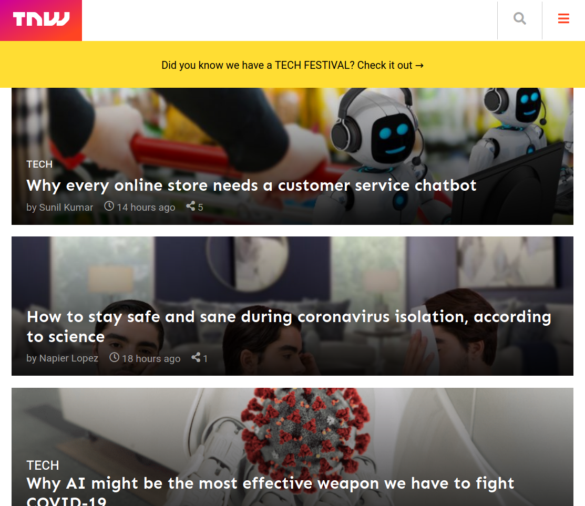

# The Next Web

## Project Description

This project required that we replicate [The next web](https://thenextweb.com/) website's home page as we put into consideration how the page display or content changes with as the device screen size increases or decreases.

## How it was Implemented

We implemented the project using the mobile-first. This means first considering how you would like the website's content to appear on the mobile or smaller screens before all the others. This is a very effective responsive development method since all content will already be optimised for the mobile view.

We started the project by first designing the mobile view of the home page using a break point of 768px and then continued to the break-point of 1024px that includes the tablet view and other screens larger than 1024px for the desktop view.

### For devices with a viewport less than 1024px

### For devices with a viewport less than 768px

Please checkout the live version of our project [here](https://raw.githack.com/Cathella/the_next_web/responsive/index.html)

## Built With

* HTML
* CSS
* VSCode
* Google fonts

## Authors

👤 **Nakitto Catherine** 
* Github: [@githubhandle](https://github.com/Cathella)
* Twitter: [@twitterhandle](https://twitter.com/cathella9)
* Linkedin: [linkedin](https://www.linkedin.com/in/catherine-nakitto-51ba2a40/)

👤 **Adewale kamilu A**  
* Github: [@githubhandle](https://github.com/adewaleK)
* Twitter: [@twitterhandle](https://twitter.com/twitterhandle)
* Linkedin: [linkedin](https://linkedin.com/linkedinhandle)

## 🤝 Contributing

Contributions, issues and feature requests are welcome!
Feel free to check the [issues page](issues/).
